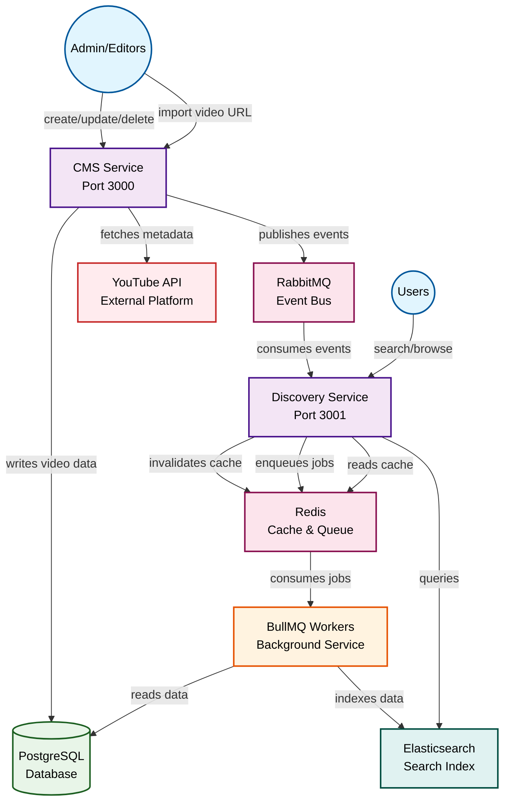

# Octonyah CMS & Discovery System

Octonyah (totally unrelated to any \*\*\*\*nyah similar sounding cms products!) is a two-component system built with NestJS and TypeScript for managing and discovering videos like video podcasts and documentaries, and potentially other forms of media. All integrated into a monorepo that hosts two independent microservices—`cms-service` and `discovery-service`—plus a shared library to reuse shared code and logic.

## Table of Contents

- [Features](#features)
- [Architecture](#architecture)
- [System Design](#system-design)
- [Service Layout](#service-layout)
- [Project Structure](#project-structure)
- [Tech Stack](#tech-stack)
- [Prerequisites](#prerequisites)
- [Running](#running)
- [Testing](#testing)
- [API Documentation](#api-documentation)

## Features

### Content Management System (CMS)
- CRUD operations for videos (video podcasts and documentaries)
- **Soft delete functionality** - Videos are soft-deleted (marked with `deletedAt` timestamp) instead of being permanently removed, allowing for recovery and audit trails
  - Soft-deleted videos are automatically excluded from all queries
  - Redis cache and Elasticsearch index are immediately cleared when a video is soft-deleted
  - Automatic cleanup job permanently deletes videos soft-deleted more than 90 days ago
- **Video importing from external platforms** (YouTube support built-in, extensible for other platforms)
  - Automatic metadata extraction (title, description, duration, thumbnail, tags)
  - Platform thumbnail URLs stored directly (no download - YouTube thumbnails are CDN-hosted and reliable)
  - Duplicate detection to prevent re-importing the same video
  - Platform-specific fields (embedUrl, platformVideoId)
  - Optional custom thumbnail uploads for editors
- Metadata management (title, description, category, duration, publication date)
- Input validation and error handling
- RESTful API endpoints for frontend integration
- Swagger documentation
- JWT auth + RBAC (admin, editor) for CMS-only endpoints
- Admin-only Elasticsearch reindex trigger for search index rebuilds
- Health check endpoints for monitoring and orchestration
- **Rate limiting** - Redis-backed distributed rate limiting to prevent abuse

### Discovery System
- Public API endpoints for searching videos and content
- Search interface with full text search
- Filtering by category and type
- Pagination support
- Browse videos by category or type
- Redis-backed cache with automatic invalidation via RabbitMQ events
- Elasticsearch secondary index powering fast full-text search, filters, and sort options
- BullMQ-powered background job workers that reindex Elasticsearch asynchronously
- Health check endpoints monitoring database, Redis, and Elasticsearch connectivity
- **Rate limiting** - Redis-backed distributed rate limiting for public API protection

## Architecture

### System Architecture Diagram



## System Design

### 1. NestJS Framework

- Built-in support for TypeScript
- Modular architecture out of the box
- Inversion of control thru its dependency injection system
- Built-in support for Swagger, validation, and testing

### 2. PostgreSQL Database

- Production-ready transactional relational database with strong reliability guarantees
- Works seamlessly with TypeORM and NestJS ecosystem
- **Soft delete support** - Videos use TypeORM's `@DeleteDateColumn` for soft deletes, allowing data recovery and maintaining audit trails
  - Soft-deleted videos are automatically excluded from standard queries
  - `deletedAt` timestamp tracks when videos were soft-deleted
  - Automatic cleanup job permanently removes videos soft-deleted more than 90 days ago
- If scaling vertically becomes infeasible down the line, then we can upgrade Postgres to Citus Data distributed database to scale horizontally

### 3. Microservices + Shared Library

- CMS and Discovery as separate NestJS applications that share a small library.
- Teams can deploy/scale authoring and discovery independently
- Shared library keeps entities in sync without tight coupling
- Public surface (discovery) does not expose write operations
- Each service can be replicated or containerized

### 4. RabbitMQ Event Bus

- Use RabbitMQ for asynchronous communication between services.
- Decouples CMS's writes from discovery's read-side concerns (cache, index, analytics)
- Offers durable delivery and retry semantics out of the box

### 5. Redis Cache for Discovery

- Cache read-heavy discovery endpoints (search + video detail) in Redis with TTL and invalidate via CMS events.
- Reduces load on Postgres when discovery traffic spikes
- Keeps cache warm for the most common queries
- TTL ensures stale data eventually expires even if an event is missed
- CMS-driven events purge stale keys immediately (video-level + all search keys)

### 6. Elasticsearch as the Read Model
- Discovery search is delegated to Elasticsearch while PostgreSQL remains the write model.
- Search-as-you-type analyzers, full-text relevance, and aggregations are native features
- PostgreSQL stays optimized for canonical writes, relations, and transactions
- RabbitMQ + BullMQ keep indices eventually consistent without synchronous coupling
- Discovery can scale independently for high read traffic

### 7. BullMQ Background Jobs
- Use BullMQ (Redis-backed) workers inside the discovery service to rebuild and heal the Elasticsearch index.
- Queue provides retryable, observable jobs for large reindex operations
- Decouples RabbitMQ event handling from heavy index writes
- Allows triggering reindexing via HTTP without locking the main request cycle


### 9. External Video Platform Integration (YouTube, etc.)
- Pluggable provider architecture allows importing videos from external platforms
- **YouTube provider** uses YouTube Data API v3 to extract metadata:
  - Title, description, duration (ISO 8601 parsed to seconds), publication date
  - Best quality thumbnail URL (maxres → standard → high → medium → default)
  - Channel name, tags, view/like counts
  - Embed URL for frontend video players
- Video URLs are auto-detected from various formats (watch, youtu.be, embed, shorts)
- Duplicate detection prevents re-importing the same video
- User can override extracted metadata (title, description, tags) during import
- Easy to extend with additional providers (Vimeo, Dailymotion, etc.)

## Service Layout

This repository follows a monorepo layout with two microservices and shared libraries:

- `apps/cms-service` – Internal CMS microservice responsible for authoring, validating, and publishing videos.
- `apps/discovery-service` – Public-facing microservice that exposes search/browse APIs for end users.
- `libs/shared-videos` – Shared TypeORM entities, enums, and event contracts.
- `libs/shared-config` – Shared infrastructure configuration (database, Swagger, validation).
- `libs/shared-events` – RabbitMQ event system (publishers, listeners, configuration).
- `libs/shared-cache` – Redis caching module and service.
- `libs/shared-video-platforms` – External video platform integration (YouTube API, metadata extraction, provider abstraction).
- `libs/shared-throttler` – Distributed rate limiting with Redis storage and preset decorators.

Each service has its own entry point (`main.ts`), module tree, Swagger document, and can be deployed/scaled independently. Shared code is imported through path aliases (e.g., `@octonyah/shared-videos`, `@octonyah/shared-config`) to keep the services decoupled while avoiding duplication.

Supporting infrastructure (local/dev via Docker Compose):

- `postgres` – canonical system of record for videos
- `rabbitmq` – async event bus between services
- `redis` – cache backing the discovery service and transport for BullMQ queues
- `elasticsearch` – search/read model optimized for full-text queries, filtering, autocomplete
- `bullmq workers` – discovery-service background processors that rebuild the search index

## Inter-service Communication

- **Asynchronous messaging**: CMS publishes RabbitMQ events (`video.created`, `video.updated`, `video.deleted`, `video.reindex_requested`) whenever content changes or an admin requests a full reindex. Discovery subscribes to the same queue using NestJS's RMQ transport, enabling cache invalidation, search-index refreshes, analytics fan-out, etc.
- **Shared contracts**: Event names and payload contracts live in `libs/shared-videos`, ensuring publishers and consumers stay aligned without tight coupling.
- **Caching + invalidation**: Discovery caches read-heavy endpoints (individual video fetch + search queries) in Redis with a configurable TTL. CMS emits events, and the discovery service invalidates affected cache keys immediately (video-specific keys + all search-result caches), keeping cached data fresh without synchronous coordination.
- **Elasticsearch read model**: Discovery maintains a secondary search index that is updated asynchronously from CMS events and BullMQ worker jobs, allowing fast full-text search, filtering, and sorting without hammering Postgres.
- **Soft delete handling**: When a video is soft-deleted in PostgreSQL (marked with `deletedAt`), the system immediately removes it from Redis cache and Elasticsearch index via RabbitMQ events. This ensures soft-deleted videos don't appear in search results or cached responses, while PostgreSQL maintains the record for recovery and audit purposes.
- **Scalable & Future-ready**: Additional consumers (Redis cache warmers, BullMQ queues, analytics services) can subscribe to the same events without modifying the core services.

## Project Structure

```
apps/
├── cms-service/
│   └── src/
│       ├── app.controller.ts
│       ├── app.module.ts
│       ├── main.ts
│       ├── auth/                          # Authentication & Authorization
│       │   ├── auth.controller.ts
│       │   ├── auth.module.ts
│       │   ├── auth.service.ts
│       │   ├── dto/
│       │   │   └── login.dto.ts
│       │   ├── guards/
│       │   │   ├── jwt-auth.guard.ts
│       │   │   └── roles.guard.ts
│       │   ├── jwt-payload.interface.ts
│       │   ├── jwt.strategy.ts
│       │   └── roles.decorator.ts
│       ├── health/                        # Health check endpoints
│       │   ├── health.controller.ts
│       │   └── health.module.ts
│       └── modules/
│           ├── cms.module.ts
│           └── videos/
│               ├── dto/
│               │   ├── import-video.dto.ts     # DTO for importing from external platforms
│               │   └── update-video.dto.ts
│               ├── videos.controller.ts
│               ├── videos.module.ts
│               └── videos.service.ts
└── discovery-service/
    └── src/
        ├── app.controller.ts
        ├── app.module.ts
        ├── main.ts
        ├── health/                        # Health check endpoints
        │   ├── health.controller.ts
        │   ├── health.module.ts
        │   ├── redis-health.indicator.ts
        │   └── elasticsearch-health.indicator.ts
        ├── jobs/                          # Background job processing
        │   ├── jobs.module.ts
        │   ├── video-index.processor.ts
        │   ├── video-index.queue.service.ts
        │   ├── video-index.queue.ts
        │   ├── cleanup-soft-deletes.processor.ts  # Cleanup job for old soft-deleted videos
        │   ├── cleanup-soft-deletes.queue.service.ts
        │   └── cleanup-soft-deletes.queue.ts
        ├── modules/
        │   ├── discovery.module.ts
        │   ├── discovery.controller.ts
        │   ├── discovery.service.ts
        │   ├── video-events.listener.ts  # RabbitMQ event listener
        │   └── dto/
        │       ├── search-videos.dto.ts
        │       └── search-response.dto.ts
        └── search/                        # Elasticsearch integration
            ├── search.module.ts
            ├── video-search.service.ts
            └── video-search.types.ts

libs/
├── shared-videos/                       # Domain entities & events
│   └── src/
│       ├── entities/
│       │   └── video.entity.ts
│       ├── events/
│       │   └── video-events.ts
│       └── index.ts
├── shared-config/                         # Infrastructure configuration
│   └── src/
│       ├── database/
│       │   └── database.module.ts
│       ├── bootstrap/
│       │   ├── swagger-config.factory.ts
│       │   └── validation-pipe.config.ts
│       └── index.ts
├── shared-events/                         # Event system (RabbitMQ)
│   └── src/
│       ├── rmq/
│       │   └── rmq.module.ts
│       ├── publisher/
│       │   ├── event-publisher.service.ts
│       │   └── video-events.publisher.ts
│       ├── listener/
│       │   └── event-listener.base.ts
│       └── index.ts
├── shared-cache/                          # Redis caching
│   └── src/
│       ├── redis-cache.module.ts
│       ├── redis-cache.service.ts
│       ├── cache.constants.ts
│       └── index.ts
├── shared-throttler/                      # Rate limiting
│   └── src/
│       ├── throttler.module.ts
│       ├── throttler.constants.ts
│       ├── decorators/
│       │   ├── throttle.decorator.ts
│       │   └── skip-throttle.decorator.ts
│       └── index.ts
└── shared-video-platforms/                # External platform integration
    └── src/
        ├── providers/
        │   └── youtube.provider.ts        # YouTube Data API v3 integration
        ├── types/
        │   ├── platform-provider.interface.ts
        │   └── video-metadata.interface.ts
        ├── utils/
        │   └── iso8601-duration.util.ts   # YouTube duration parser (PT1H2M30S → seconds)
        ├── video-platforms.module.ts
        ├── video-platforms.service.ts
        └── index.ts

test/                                      # All tests (unit + e2e)
├── cms-service/                           # CMS unit tests
├── discovery-service/                     # Discovery unit tests
├── libs/                                  # Shared library unit tests
├── cms-service.e2e-spec.ts               # CMS e2e tests
├── discovery-service.e2e-spec.ts         # Discovery e2e tests
└── jest-e2e.json                         # E2E Jest config
```

### Modular Architecture

Octonyah follows a **microservices architecture** layered on top of NestJS' modular pattern with shared libraries:

#### Microservices

1. **CMS microservice (`apps/cms-service`)** – Internal content management
   - Handles CRUD operations for videos
   - **Imports videos from external platforms** (YouTube support built-in)
   - JWT-based authentication with role-based access control (admin, editor)
   - Validates input data using class-validator
   - Manages video metadata
   - Stores platform thumbnail URLs directly (no download - YouTube thumbnails are CDN-hosted and reliable)
   - Publishes events to RabbitMQ when videos are created/updated/deleted
   - Uses shared libraries: `shared-videos`, `shared-config`, `shared-events`, `shared-video-platforms`

2. **Discovery microservice (`apps/discovery-service`)** – Public search and exploration
   - Provides search functionality with full-text search via Elasticsearch
   - Implements filtering, pagination, and browse experiences
   - Redis-backed caching with automatic invalidation via RabbitMQ events
   - BullMQ-powered background jobs for Elasticsearch reindexing
   - Returns platform thumbnail URLs directly
   - Exposes only read APIs to keep the surface limited and cache-friendly
   - Uses shared libraries: `shared-videos`, `shared-config`, `shared-events`, `shared-cache`

#### Shared Libraries

3. **Shared Videos (`libs/shared-videos`)**
   - Hosts the `Video` TypeORM entity and enums so both services stay in sync
   - Defines event contracts (`video.created`, `video.updated`, `video.deleted`, `video.reindex_requested`)
   - Single source of truth for domain models

4. **Shared Config (`libs/shared-config`)**
   - Centralized TypeORM database configuration
   - Reusable Swagger configuration factory
   - Shared ValidationPipe configuration
   - Eliminates duplication across services

5. **Shared Events (`libs/shared-events`)**
   - RabbitMQ module configuration
   - Event publisher service for publishing domain events
   - Event listener base classes for consuming events
   - Standardized event communication patterns

6. **Shared Cache (`libs/shared-cache`)**
   - Redis cache module and service
   - Provides caching utilities with TTL support
   - Used by discovery service for read-heavy endpoints

7. **Shared Video Platforms (`libs/shared-video-platforms`)**
   - Pluggable provider architecture for external video platforms
   - YouTube provider with Data API v3 integration
   - Auto-detection of platform from URL
   - Standardized metadata extraction interface
   - ISO 8601 duration parsing utility
   - Easy to extend with new providers (Vimeo, Dailymotion, etc.)

8. **Shared Throttler (`libs/shared-throttler`)**
   - Distributed rate limiting with Redis storage
   - Preset decorators for different endpoint types (auth, read, write, heavy)
   - Per-service default configurations (CMS vs Discovery)
   - Skip decorator for exempt endpoints (health checks)

## Tech Stack

### Backend Framework
- **NestJS** - Node.js framework
- **TypeScript** - So that I don't lose my mind programming in cowboy JavaScript

### Messaging & Communication
- **RabbitMQ** - Asynchronous event bus for cross-service communication

### Caching, Rate Limiting & Background Jobs
- **Redis** - Distributed cache for potentially read-heavy discovery endpoints with TTL and invalidation
- **BullMQ** - Redis-backed queues that power Elasticsearch reindex jobs
- **@nestjs/throttler** - Distributed rate limiting with Redis storage for API protection

### Search & Read Models
- **Elasticsearch** - Secondary index optimized for full-text search, filters, and high-concurrency read/query workloads


### Database & ORM
- **PostgreSQL** - Reliable relational database, easy to run locally via Docker
- **TypeORM** - Object-Relational Mapping for database operations

### Validation & Transformation
- **class-validator** - Decorator-based validation
- **class-transformer** - Object transformation utilities

### API Documentation
- **Swagger/OpenAPI** - Interactive API documentation

### Monitoring & Health Checks
- **@nestjs/terminus** - Health check framework for monitoring service dependencies

### Development Tools
- **Node.js v20+** - Required runtime (use `.nvmrc` with nvm for automatic version switching)
- **Jest** - Testing framework for unit and e2e tests
- **Supertest** - HTTP assertion library for e2e API testing
- **ESLint** - Code linting
- **Prettier** - Code formatting

## Prerequisites

### Node.js Version

This project requires **Node.js v20 or higher**. The repository includes an `.nvmrc` file for automatic version switching.

**Using nvm (recommended):**
```bash
# Install nvm if you haven't already
brew install nvm

# In the project directory, switch to the correct Node.js version
nvm use

# Or install it if not available
nvm install
```

**Without nvm:**
Ensure you have Node.js v20+ installed by checking:
```bash
node -v  # Should output v20.x.x or higher
```

## Running

#### Getting a YouTube API Key

To enable YouTube video importing, you need a YouTube Data API v3 key:

1. Go to [Google Cloud Console](https://console.cloud.google.com/)
2. Create a new project or select an existing one
3. Navigate to **APIs & Services** → **Library**
4. Search for "YouTube Data API v3" and enable it
5. Go to **APIs & Services** → **Credentials**
6. Click **Create Credentials** → **API key**
7. (Optional) Restrict the key to YouTube Data API v3 for security
8. Copy the key and set it as `YOUTUBE_API_KEY` environment variable in .env

### Docker Compose (Running all services)

Run the entire stack (Postgres + both microservices) with a single command:

```bash
docker compose up --build
```

Exposed endpoints:

- CMS service → http://localhost:3000 (Swagger at `/api`)
- Discovery service → http://localhost:3001 (Swagger at `/api`)
- RabbitMQ → AMQP `localhost:5672`, management UI `http://localhost:15672` (guest/guest)
- Redis → `localhost:6379`
- BullMQ workers → run inside discovery-service container, exposed via logs/queues
- Postgres → `localhost:5432` (credentials defined in `docker-compose.yml`)

## Testing

The project includes comprehensive test coverage with both **unit tests** and **end-to-end (e2e) tests**. All tests are located in the `test/` directory, separate from source code.

### Unit Tests

Unit tests test individual components (services, controllers, guards, etc.) in isolation with mocked dependencies.

**Test coverage includes:**
- **CMS Service (8 tests):** Auth service, auth controller, JWT strategy, roles guard, videos service, videos controller, health controller, app controller
- **Discovery Service (11 tests):** Discovery service, discovery controller, video search service, video index processor, queue service, cleanup processor, event listener, health indicators (Redis, Elasticsearch), app controller
- **Shared Libraries (8 tests):** Redis cache service, cache constants, YouTube provider, video platforms service, ISO8601 duration utils, event publisher, video events publisher, validation pipe config

**Total: 27 test suites, 216 tests**

### End-to-End (E2E) Tests

E2E tests verify the full HTTP request/response cycle using **Supertest**. They test API endpoints with the application bootstrapped (with mocked infrastructure), simulating real client requests.

**E2E test coverage includes:**
- **CMS Service E2E (21 tests):** Authentication flow, JWT token generation, video CRUD operations, role-based access control, input validation
- **Discovery Service E2E (17 tests):** Search functionality, filtering, pagination, category/type browsing, caching behavior

**Total: 2 test suites, 38 tests**

### Running All Tests

```bash
# Run all unit tests
npm test

# Run all e2e tests
npm run test:e2e

# Run both unit and e2e tests
npm test && npm run test:e2e
```

### Comprehensive Integration Test Script

The project includes a comprehensive shell script (`comprehensive-test.sh`) that used Opus 4.5 to write it, it performs full end-to-end integration testing against the running Docker services. It script tests the entire system including YouTube API integration, database operations, Elasticsearch search, and role-based access control. It also seeds into the test 5 videos from Thmanyah's youtube channel as samples.

So make sure you have the YouTube API key already set up :)

**Run the comprehensive test:**
```bash
# Make the script executable
chmod +x comprehensive-test.sh

# Flush Redis rate limits before testing
docker exec octonyah-redis redis-cli FLUSHALL

# Run the comprehensive test
./comprehensive-test.sh
```

**What the script tests (84 tests total):**

| Section | Tests |
|---------|-------|
| **Infrastructure Health** | Docker containers, CMS/Discovery root endpoints, health checks (DB, Redis, Elasticsearch) |
| **Authentication** | Admin/editor login, invalid credentials, missing fields validation, JWT token generation |
| **YouTube Video Import** | Import 5 real YouTube videos, metadata extraction (title, description, duration, thumbnail), custom overrides, duplicate detection, unsupported platforms |
| **Video CRUD (CMS)** | Get all videos, get by ID, update title/category/tags/type/date, validation errors, 404 handling |
| **Discovery Search** | Full-text search, category/type/tags filters, date range, sorting (relevance/date/popular), pagination |
| **Discovery Browse** | Get video by ID, browse by category, browse by type, pagination |
| **Reindex Operation** | Admin can reindex, editor denied (403) |
| **Role-Based Access** | Editor cannot delete (403), admin can delete (204), soft delete verification |
| **Cleanup** | Automatic cleanup of test data |

**Sample output:**
```
╔══════════════════════════════════════════════════════════════╗
║    OCTONYAH VIDEO PLATFORM - COMPREHENSIVE API TESTING       ║
╚══════════════════════════════════════════════════════════════╝

✓ CMS and Discovery containers are running
✓ Admin login successful
✓ Video 1 imported successfully (ID: d060ce9d...)
✓ Video 1 metadata correctly extracted from YouTube
✓ Search all videos works (total: 5)
✓ Editor correctly denied delete access (403)
...

╔══════════════════════════════════════════════════════════════╗
║                      TEST SUMMARY                            ║
╚══════════════════════════════════════════════════════════════╝

  Passed: 84
  Failed: 0
  Total:  84

╔══════════════════════════════════════════════════════════════╗
║                 ✓ ALL TESTS PASSED!                          ║
╚══════════════════════════════════════════════════════════════╝
```

**Note:** The auth endpoint has strict rate limiting (5 requests/minute). If you encounter rate limit errors (429), flush Redis and wait before re-running: `docker exec octonyah-redis redis-cli FLUSHALL`

## API Documentation

### Authentication (CMS service)

- `POST /auth/login` – Exchange username/password for a JWT access token.
- Sample users (stored in-memory for this prototype):
  - **Admin** – username: `admin`, password: `admin123` (roles: admin + editor)
  - **Editor** – username: `editor`, password: `editor123` (role: editor)
- Include the JWT via `Authorization: Bearer <token>` on any `/cms/**` request.
- RBAC summary:
  - `admin` → full access (create, update, delete, reindex)
  - `editor` → create/update/read only (no delete, no reindex)

### Swagger UI

Once each service is running, Swagger UI is exposed per service:

- CMS service: `http://localhost:${CMS_PORT}/api` (default `http://localhost:3000/api`)
- Discovery service: `http://localhost:${DISCOVERY_PORT}/api` (default `http://localhost:3001/api`)

Swagger UI provides:
- Complete API endpoint documentation
- Interactive testing interface
- Request/response schemas
- Example requests

### API Endpoints

#### CMS service (internal)
- Base URL: `http://localhost:${CMS_PORT}` (default `http://localhost:3000`)
- `GET /` - Hello World endpoint for testing
- `POST /cms/videos/import` - **Import a video from external platform** (YouTube, etc.)
- `GET /cms/videos` - Get all videos
- `GET /cms/videos/:id` - Get a video by ID
- `PATCH /cms/videos/:id` - Update a video
- `DELETE /cms/videos/:id` - Soft delete a video
- `POST /cms/videos/reindex` - **Trigger full Elasticsearch reindex** (admin only)

#### Discovery service (public)
- Base URL: `http://localhost:${DISCOVERY_PORT}` (default `http://localhost:3001`)
- `GET /` - Hello endpoint for sanity checks
- `GET /discovery/search` - Search videos with filters and pagination
- `GET /discovery/videos/:id` - Get a video by ID (public)
- `GET /discovery/categories/:category` - Get videos by category
- `GET /discovery/types/:type` - Get videos by type

#### Health Check Endpoints
Both services expose health check endpoints for monitoring and orchestration:

- **CMS Service**: `GET /health` - Checks database connectivity
- **Discovery Service**: `GET /health` - Checks database, Redis, and Elasticsearch connectivity

##### Search query parameters (`GET /discovery/search`)
- `q` – Free-text query (title, description, tags) with fuzzy matching
- `category`, `type` – Exact-match filters
- `tags` – Repeatable query param for multi-tag filtering (`?tags=tech&tags=history`)
- `startDate` / `endDate` – Filter by publication date range (ISO strings)
- `sort` – `relevance` (default), `date` (newest first), or `popular`
- `page` / `limit` – Pagination controls (limit capped at 100)

### Example API Calls

**Import a YouTube video:**
```bash
curl -X POST http://localhost:3000/cms/videos/import \
  -H "Content-Type: application/json" \
  -H "Authorization: Bearer <your-jwt-token>" \
  -d '{
    "url": "https://www.youtube.com/watch?v=testQ",
    "category": "History",
    "type": "video_podcast"
  }'
```

The import endpoint:
1. Detects the platform from the URL (YouTube in this case)
2. Calls the YouTube Data API to fetch metadata (title, description, duration, thumbnail, tags)
3. Stores the platform thumbnail URL directly (no download - YouTube thumbnails are CDN-hosted and reliable)
4. Creates the video record with platform-specific fields:
   - `platform: "youtube"`
   - `platformVideoId: "dQw4w9WgXcQ"`
   - `embedUrl: "https://www.youtube.com/embed/dQw4w9WgXcQ"`
   - `thumbnailUrl: "https://i.ytimg.com/vi/.../maxresdefault.jpg"` (platform thumbnail URL)
5. Publishes event to RabbitMQ for discovery service to index

Optional fields for overriding extracted metadata:
- `title` - Override the YouTube video title
- `description` - Override the YouTube video description
- `tags` - Additional tags (merged with YouTube tags)

Supported YouTube URL formats:
- `https://www.youtube.com/watch?v=VIDEO_ID`
- `https://youtu.be/VIDEO_ID`
- `https://www.youtube.com/embed/VIDEO_ID`
- `https://www.youtube.com/shorts/VIDEO_ID`

**Search videos (discovery service):**
```bash
curl "http://localhost:3001/discovery/search?q=technology&tags=innovation&tags=startup&sort=date&limit=10"
```

## License

This project is licensed under the "if this system makes you lose all of your content and sets your computer on fire then don't associate me with it" license 🥀.
